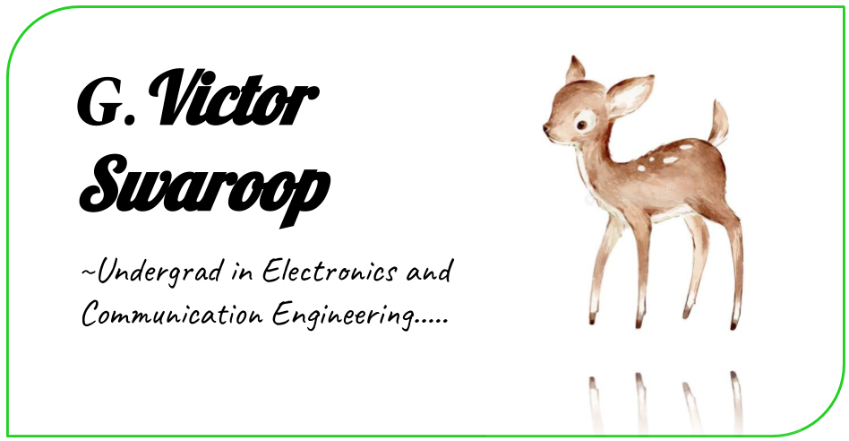

## *Victor Swaroop* 
***@GVictorsd***



Hey, folks! This is Victor Swaroop. I am an undergraduate in Electronics and Communication Engineering with a bit of passion in Computer Science and Computer Architecture...🙂😊

```
programming_languages_known = ['C',
                               'C++',
                               'Python3',
                               'BASH',
                               'Verilog HDL',
                               'MATLAB']
print('...and expanding;)')
```

### Find me on:


#### victorswaroop2002@gmail.com


#### [LinkedIn](https://www.linkedin.com/in/gummadi-victor-9653ab1b0)


#### [Twitter](https://www.twitter.com/victor_gummadi)

